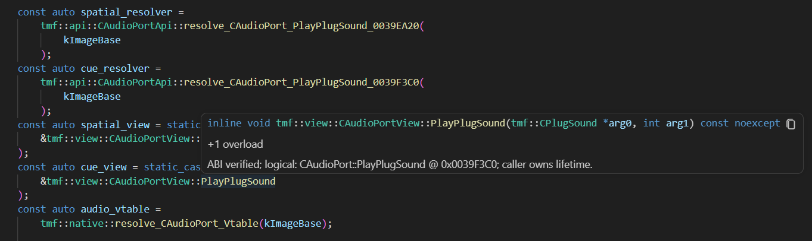
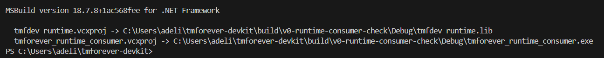
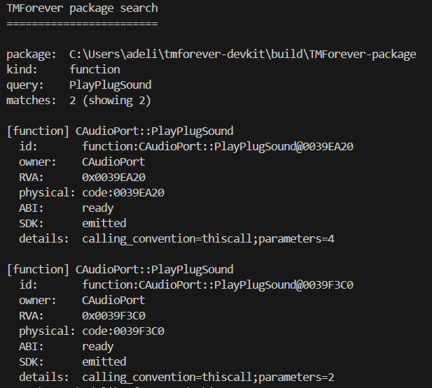
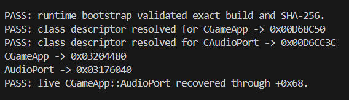

# TMForever DevKit

TMForever DevKit generates a verified native C++ SDK for TrackMania Forever.
It builds a canonical model of one exact `TmForever.exe` build from its MAP
file, executable bytes, RTTI, vtables, GameBox reflection data and other
evidence. The result is a set of C++ headers, a searchable manifest, an
offline index and a small checked runtime layer.

The point is practical: a native TMNF/TMUF project should not have to maintain
its own collection of raw addresses and handwritten declarations. When the
evidence is not strong enough, tmfdev leaves the declaration unsupported
instead of guessing.

This is V0 Beta, released as `v0.1.0-beta`. It is an unofficial community project
and is not affiliated with or endorsed by Nadeo or Ubisoft. The MIT license
covers TMForever DevKit source code; it does not grant rights to TrackMania or
Nadeo/Ubisoft assets, binaries, trademarks or proprietary game code.

## Using the SDK

Normal SDK use starts with the generated release package. You do not need to
clone the full TMForever DevKit repository, build the extractor or provide a
`TmForever.map` file just to consume the SDK.

### Install into an existing CMake project

For a project laid out like this:

```text
my-mod/
  CMakeLists.txt
  src/
  external/
```

run this from the project root. Replace the value of `$url` with the asset URL
from the `v0.1.0-beta` GitHub release when the public repository is published.
The rest of the extraction logic is the release-package layout used here.

```powershell
Set-Location "C:\path\to\my-mod"

$version = "v0.1.0-beta"
$url = "https://github.com/cdexstra/tmforever-devkit/releases/download/v0.1.0-beta/tmforever-devkit-v0.1.0-beta.zip"
$project = (Get-Location).Path
$external = Join-Path $project "external"
$archive = Join-Path $external "tmforever-devkit-$version.zip"
$staging = Join-Path $external "_tmforever-devkit-$version"
$package = Join-Path $external "tmforever-devkit"

New-Item -ItemType Directory -Path $external -Force | Out-Null
if ((Test-Path -LiteralPath $archive) -or
    (Test-Path -LiteralPath $staging) -or
    (Test-Path -LiteralPath $package)) {
    throw "An existing tmforever-devkit installation or temporary archive was found. Remove it or choose another project directory."
}

Invoke-WebRequest -Uri $url -OutFile $archive
Expand-Archive -LiteralPath $archive -DestinationPath $staging

$extracted = Join-Path $staging "tmforever-devkit-$version"
if (-not (Test-Path -LiteralPath $extracted -PathType Container)) {
    throw "The release archive does not contain the expected package directory."
}

Move-Item -LiteralPath $extracted -Destination $package
Remove-Item -LiteralPath $archive -Force
Remove-Item -LiteralPath $staging -Recurse -Force
```

The result is one stable dependency path, without a second versioned package
directory:

```text
my-mod/
  CMakeLists.txt
  src/
  external/
    tmforever-devkit/
      include/
      metadata/
      src/
      tmfdev.cmake
      package.json
      README.md
      LICENSE
```

### Add the package to CMake

Add the generated package interface before defining or linking your target:

```cmake
include("${CMAKE_SOURCE_DIR}/external/tmforever-devkit/tmfdev.cmake")

target_link_libraries(my_mod PRIVATE
    tmfdev::sdk
    tmfdev::runtime
)
```

`tmfdev::sdk` supplies the generated headers. `tmfdev::runtime` is optional;
omit it when the project only needs declarations and metadata. The runtime
target is for a Windows 32-bit consumer.

### Build the existing project

The generated package targets the 32-bit game, so configure with the Win32
generator:

```powershell
Set-Location "C:\path\to\my-mod"

cmake -S . -B build -A Win32
cmake --build build --config Debug
```

If the project already has a configured build directory, add the package
include and target links, then reconfigure and build it as usual.

### A small runtime example

This is a complete startup-shaped example using only the packaged SDK and
runtime. Call it from the mod's normal startup callback, not from `DllMain`:

```cpp
#include <TMForever_all.hpp>
#include <tmfdev/runtime.hpp>

int mod_start()
{
    const auto runtime = tmf::runtime::Context::current_process();
    if (!runtime)
        return 1;

    auto* game = runtime.game_app();
    if (!game)
        return 0; // The game-owned root is not currently published.

    auto* audio = runtime.audio_port();
    if (!audio)
        return 0;

    using PlayCue =
        tmf::native::CAudioPort_PlayPlugSound_0039F3C0Fn;
    const auto play_cue = runtime.resolve_function<PlayCue>(
        tmf::native::CAudioPort_PlayPlugSound_0039F3C0Rva
    );

    return play_cue != nullptr ? 0 : 1;
}
```

`Context` does not own or cache the returned engine objects. The example only
resolves the call; a mod still needs a valid game-owned sound object and the
correct game state before invoking it.



*Generated overloads and resolver views in an IDE.*

### Start a new project

For a new minimal project, create:

```text
my-mod/
  CMakeLists.txt
  src/
    main.cpp
  external/
    tmforever-devkit/
```

`CMakeLists.txt` can be:

```cmake
cmake_minimum_required(VERSION 3.20)
project(my_mod LANGUAGES CXX)

set(CMAKE_CXX_STANDARD 20)
set(CMAKE_CXX_STANDARD_REQUIRED ON)
set(CMAKE_CXX_EXTENSIONS OFF)

include("${CMAKE_SOURCE_DIR}/external/tmforever-devkit/tmfdev.cmake")

add_library(my_mod SHARED
    src/main.cpp
)

target_link_libraries(my_mod PRIVATE
    tmfdev::sdk
    tmfdev::runtime
)
```

Use this as `src/main.cpp`:

```cpp
#include <tmfdev/runtime.hpp>

int mod_start()
{
    const auto runtime = tmf::runtime::Context::current_process();
    return runtime ? 0 : 1;
}
```

Then build it with:

```powershell
Set-Location "C:\path\to\my-mod"
cmake -S . -B build -A Win32
cmake --build build --config Debug
```

### Release package or source checkout?

Use `tmforever-devkit-v0.1.0-beta.zip` when you want to build a mod. It
contains the generated SDK, checked runtime, CMake targets, build metadata,
manifest, search index and package documentation. The full repository is for
contributors and researchers working on the canonical model, generators,
tests, evidence and optional runtime probes.

The release package does not include the source-side `tmfdev.exe` tool. The
metadata files are available for tools that consume the package directly; the
inspection and generation commands documented below require a source checkout
with `tmfdev` built.

## What is included

- generated C++ declarations and RVA-specific resolvers for ABI-ready APIs;
- class-scoped headers and non-owning class views where the call shape is
  unambiguous;
- exact-build class IDs, vtable information and RTTI relationships;
- GameBox reflection descriptors, including members, actions, procedures and
  virtual parameters;
- verified reflection-backed member offsets and address-only globals;
- ready, conditional and blocked status for the canonical model;
- provenance and evidence details in the manifest and inspection commands;
- deterministic package generation with artifact hashes;
- checked runtime build validation, RVA resolution and proven nullable roots;
- small editor, input, audio and external-package consumers.

The SDK is intentionally not a C++ reimplementation of the game. A generated
class view wraps a caller-supplied native pointer. It does not allocate,
destroy or inherit from the native object.

## Supported build

The current dataset targets the 32-bit `TmForever.exe` from the TMNF 2.11.26
executable family. The generated files are for this exact file, not for every
TMNF or TMUF installation.

| Field | Value |
| --- | --- |
| Machine | PE32 / x86 (`0x14C`) |
| Linker timestamp | `0x4D431494` |
| Preferred image base | `0x00400000` |
| Image size | `0x00A2B000` |
| File size | `10,498,048` bytes |
| SHA-256 | `3847cf9f20bfc63914450060ed528c12104f743d96ad23d6e76abd178de8c84f` |

Runtime initialization checks the loaded PE identity and, through
`Context::current_process()`, the SHA-256 of the executable file. The runtime
does not silently fall back to a nearby build. Addresses, layouts and vtable
data from another version remain research evidence until verified for this
target.

## Generate a package from source

This is the contributor/researcher workflow, not the normal SDK installation
path. It rebuilds the generated package from an exact executable and matching
MAP file.

Generate a whole-model package from the source checkout and the exact game
inputs:

```powershell
Set-Location "C:\path\to\tmforever-devkit"

$repo = (Get-Location).Path
$exe = "C:\path\to\TmForever.exe"
$map = "C:\path\to\TmForever.map"
$package = Join-Path $repo "build\TMForever-package"

& "$repo\build\Debug\tmfdev.exe" generate-package `
    $package $exe $map
& "$repo\build\Debug\tmfdev.exe" verify-package `
    $package $exe $map
```

The generated package contains:

```text
include/TMForever_all.hpp       broad generated SDK
include/tmfdev/runtime.hpp      checked runtime declarations
src/tmfdev_runtime.cpp          runtime implementation
metadata/TMForever_manifest.json
metadata/search-index.tsv
tmfdev.cmake                    CMake interface targets
package.json                    schema, build identity, counts and hashes
README.md                       package-specific usage notes
```

The package is relocatable. Include its `tmfdev.cmake` file and link
`tmfdev::sdk`; link `tmfdev::runtime` as well when using the runtime source.
The runtime target requires Windows and a 32-bit consumer and links the Windows
`bcrypt` library.



*A standalone consumer building outside the source checkout.*

For a smaller class package, generate the requested class explicitly:

```powershell
$classPackage = Join-Path $repo "build\CSceneMobil-package"
& "$repo\build\Debug\tmfdev.exe" generate-class-package `
    CSceneMobil $classPackage $exe $map
```

That package provides `include/tmfdev/CSceneMobil.hpp` and the legacy
`include/TMForever.hpp` spelling. Class-scoped generation and cached
whole-model generation are separate code paths with intentionally preserved
semantics; use the whole-model package for the broad release artifact and a
class package when you want a focused dependency.

The generated package is the normal SDK-user artifact. The source checkout is
for contributors who need to rebuild the model, inspect evidence or change the
generator. Generated release artifacts are not part of the normal Git history;
the manifest alone is over GitHub's usual 100 MiB per-file limit in the current
dataset.

## Discover the API

The release package includes the manifest and offline search index, but not the
source-side `tmfdev.exe` executable. The commands in this section are for a
source checkout where the tool has been built.

The source-built `tmfdev` executable can inspect the model against the exact
executable and MAP file:

```powershell
$tmfdev = "$repo\build\Debug\tmfdev.exe"

& $tmfdev inspect-class CTrackManiaEditor $exe $map
& $tmfdev inspect-function CTrackManiaEditor PlaceBlock $exe $map
& $tmfdev inspect-reflection CTrackManiaEditor $exe $map
& $tmfdev inspect-vtable CTrackManiaEditor $exe $map
& $tmfdev inspect-rtti CTrackManiaEditor $exe $map
```

Search the live model by entity kind:

```powershell
& $tmfdev search class TrackMania $exe $map --limit 20
& $tmfdev search function PlayPlugSound $exe $map
& $tmfdev search type GmNat $exe $map
& $tmfdev search global AudioPort $exe $map
```

Once a package exists, search its offline index without reparsing the game
files:

```powershell
& $tmfdev search-package $package function PlaceBlock
& $tmfdev search-package $package function member-pointer `
    --abi blocked --sdk skipped
```

Use `inspect-physical` before treating an RVA as unique:

```powershell
& $tmfdev inspect-physical 0x0002B500 $exe $map
```

Logical functions and physical code targets are deliberately different. Two
folded symbols can retain different names, signatures and owners while sharing
one RVA. Direct ownership is also distinct from RTTI hierarchy membership.
Vtable evidence is reported as valid, verified absent or malformed/ambiguous.

The manifest is the detailed machine-readable index. It includes canonical
IDs, ownership, signatures, ABI status, SDK emission status, physical aliases,
types, globals, reflection, vtables, hierarchy data, build identity,
provenance and skip reasons. The package search index is the smaller first
lookup surface.



*A package search result with owner, ABI status and RVA.*

## Runtime layer

The runtime component is deliberately small and loader-neutral. It provides:

- `Context::current_process()` for explicit current-process build validation;
- `Context::from_module()` for loaders that already know the loaded module and
  can optionally supply its file SHA-256;
- checked RVA-to-address and typed function resolution;
- `Context::game_app()` for the exact game-owned `CGameApp::s_TheGame` slot;
- nullable, non-owning `audio_port()` and `input_port()` access through the
  verified `CGameApp` fields;
- nullable `block_editor()` and `playground()` getters backed by exact
  read-only getter evidence and vtable-family checks;
- status names such as `unsupported_build`, `sha256_mismatch` and
  `invalid_image`.

The context validates the in-memory PE identity. `current_process()` also
hashes the executable file on disk; this identifies the supported file but does
not claim that the loaded image has not been modified after loading.
`resolve_rva()` returns zero before successful validation, for an RVA outside
the image, or on arithmetic overflow.

Returned engine pointers are game-owned and non-owning. They may be null or
change as the game changes state, and tmfdev does not claim process-lifetime,
destruction, or arbitrary-thread guarantees. In particular, the runtime does
not promise a universal current-editor or current-player-input accessor.
`block_editor()` is a guarded read-only view, not a claim that an active editor
exists in every state.



*The checked runtime path accepting the exact build.*

Do not initialize the runtime or call engine methods from `DllMain`. A loader
or mod should defer explicit initialization until its normal startup callback.
The runtime is not a mod loader, hook framework, scheduler or object-ownership
system.

## Evidence and safety model

The model combines evidence sources instead of treating any one source as a
complete ABI description. Depending on the fact, that may include:

- `TmForever.map` symbols and decorated MSVC signatures;
- executable bytes and targeted x86 checks;
- RTTI and vtable data;
- GameBox reflection descriptors;
- exact-build runtime observations;
- manually reconciled public reverse-engineering references.

Readiness is conservative:

- **Ready** means the known ABI and layout evidence is sufficient to emit the
  declaration.
- **Conditional** means a limited uncertainty or documented condition remains.
- **Blocked** means the symbol is known but tmfdev refuses to emit an unsafe
  interface.

Blocked is often a successful safety decision, not an extractor failure. Rare
member-pointer forms, unresolved enum widths, missing record layouts, hidden
aggregate returns, callbacks, arrays, STL-like records and ambiguous
declarators remain explicit skips when they cannot be represented safely.

GameBox reflection is separate from native C++ layout. A descriptor may
describe a physical member, an action, a procedure or a virtual parameter.
Signed offset `-1` entries are not automatically physical fields. RTTI proves
a relationship, not a safe C++ inheritance declaration.

## Current model

These figures describe the current exact-build dataset and are useful for
scale, not a promise that every declaration is callable:

| Item | Count |
| --- | ---: |
| Classes | 3,705 |
| Logical functions | 44,533 |
| Physical code targets | 33,329 |
| ABI-ready functions | 44,260 |
| Conditional functions | 115 |
| Blocked functions | 158 |
| Valid vtables | 1,352 |
| RTTI hierarchies | 1,301 |
| Reflection descriptors | 7,477 |
| Globals | 3,748 |

The broad generated header is roughly 40 MB, the manifest roughly 106 MB and
the search index roughly 16 MB. That is why the broad header and metadata are
release-package artifacts rather than normal source files.

## Contributing / building TMForever DevKit

Normal SDK users do not need this section. Contributors and researchers should
clone the full source repository, then build the model tools and tests. The
public repository URL will be added to this command when the repository is
published:

```powershell
git clone https://github.com/cdexstra/tmforever-devkit.git
Set-Location "tmforever-devkit"
```

Requirements:

- Windows with Visual Studio's Desktop development with C++ workload;
- 32-bit MSVC build tools and a Windows SDK;
- CMake 3.20 or newer;
- an exact `TmForever.exe` and matching `TmForever.map` when running the
  fixture-dependent checks or generating new output.

Configure and build the source tools and consumers from a Visual Studio
developer PowerShell:

```powershell
Set-Location "C:\path\to\tmforever-devkit"

cmake -S . -B build -A Win32
cmake --build build --config Debug --target `
    tmfdev sdk_smoke sdk_editor_consumer sdk_input_consumer `
    sdk_audio_consumer sdk_runtime_consumer abi_model_tests
ctest --test-dir build -C Debug --output-on-failure
```

The local executable and MAP files are intentionally not committed. When they
are present under `fixtures/local`, the additional model, package, reflection,
search and class-ID canaries are enabled. Without them, the source and
generated-header tests still run, but new model generation is not possible.

The optional `runtime_probe` is a development/research tool. It uses MinHook
and a separate sandbox installation; MinHook is not required to consume a
generated SDK package:

```powershell
Set-Location "C:\path\to\tmforever-devkit"

cmake -S runtime_probe -B runtime_probe\build -A Win32 `
    -DTMFDEV_MINHOOK_DIR="C:\path\to\minhook"
cmake --build runtime_probe\build --config Debug
runtime_probe\build\Debug\tmf_probe_injector.exe `
    "C:\path\to\TmForever.exe" `
    "C:\path\to\tmf_runtime_probe.dll"
```

Never point the probe at an ordinary game installation. It is for bounded
development observations in a separate runtime-test sandbox.

## Examples

The small consumers in `examples/` are compile and API-shape proofs:

- `editor_consumer.cpp` checks `CTrackManiaEditor::PlaceBlock`, its `GmNat3`
  carrier and the verified vtable slot;
- `input_consumer.cpp` preserves the distinct static and member
  `UpdateVehicleStateFromInputs` functions and their RVAs;
- `audio_consumer.cpp` checks both `CAudioPort::PlayPlugSound` overloads,
  class views, the verified `CGameApp::AudioPort` offset and the audio vtable;
- `examples/package_consumer` builds outside the source include tree against a
  generated class package;
- `examples/runtime_consumer` builds against a generated whole-model package
  and exercises build rejection, SHA checks, checked resolution and synthetic
  pointer/vtable guards without calling the game.

These are intentionally small. They demonstrate how the generated package is
consumed without pretending to be a general mod framework.

## Project structure

```text
src/                 canonical model, evidence readers and generators
generated/            checked class headers and runtime source used by tests
examples/             editor, input, audio and external package consumers
tests/                ABI, model, package, reflection and search canaries
runtime_probe/        optional sandbox-only runtime observation tool
fixtures/local/       ignored exact game inputs supplied by the developer
```

The source code and generated manifest remain the authority for this exact
build. The optional runtime probe is kept separate from ordinary SDK use.

## Limitations

- The generated addresses and layouts target one exact 32-bit executable.
- Some member-pointer ABIs, enum widths, record layouts and hidden returns are
  unresolved and remain unsupported.
- Not every parameter has a verified semantic name or meaning.
- Runtime object availability depends on game state.
- Ownership, destruction and thread restrictions are not universally known.
- There is no universal `current_editor()` or `current_player_input()` API.
- The SDK does not provide arbitrary GameBox object construction or destruction.
- The manifest and broad header are large; use the search index and class
  packages when a focused dependency is preferable.
- The runtime probe is a research tool, not part of ordinary SDK consumption.

## Status and license

V0 is the first public beta: useful for native development against the verified
build, with explicit unsupported boundaries and a smaller runtime surface still
being expanded through evidence.

TMForever DevKit is released under the [MIT License](LICENSE). It is an
unofficial community project and is not affiliated with or endorsed by Nadeo or
Ubisoft. TrackMania names, game binaries, assets and trademarks remain subject
to their respective owners.
